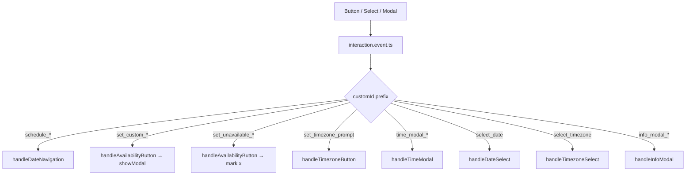

# Interactions

Beyond slash commands the bot uses three interactive Discord surfaces:

- **Buttons** — quick actions (set availability, navigate days)
- **Modals** — form input (time windows)
- **Select menus** — date and timezone pickers

`interaction.event.ts` is the single dispatcher. It inspects `customId` prefixes and
hands off to the right handler.

## Availability buttons

### Daily schedule post

The daily post embeds two buttons per relevant date:

| Button | Action |
| --- | --- |
| **✅ Available** (`set_custom_DATE`) | Opens the 3-field time modal |
| **❌ Not Available** (`set_unavailable_DATE`) | Marks the day as `x` immediately |

### Pinned weekly overview

The pinned message in `discord.channelId` carries **7 day-buttons** — one per weekday of
the current week. Clicking any opens the same time modal as `/set`. The pinned message
itself updates live whenever availability changes anywhere.

### DM reminders

Daily and weekly planning DMs include up to **7 day-buttons** (split across two rows)
for the days that still have gaps. Each button opens the same time modal.

## Time-input modal

Triggered by every `set_custom_DATE` button. Three fields:

| Field | Required | Description |
| --- | --- | --- |
| `start_time` | yes | `HH:MM` |
| `end_time` | yes | `HH:MM` |
| `additional_windows` | no | Comma-separated extra windows, e.g. `17:00-20:00, 21:00-23:00` |

On submit the value is parsed, converted from the player's timezone to the bot timezone
if needed, and persisted via `updatePlayerAvailability`. The submission then triggers
both `checkAndNotifyStatusChange` and `refreshWeeklyOverview`.

::: tip Marking unavailable
The modal accepts time windows only. To mark a day as unavailable, use the
**❌ Not Available** button (daily post) or the `/set` slash command's unavailable
branch.
:::

## Navigation buttons

For multi-day embeds (schedule navigation):

- **← Previous Day**
- **Today**
- **Next Day →**

Buttons are disabled when the target date is out of the 14-day window.

## Timezone selector

A select menu with common IANA timezones, rendered when a player without a personal
timezone clicks the **🌍 Set Timezone** button on a reminder DM. `/set-timezone` exposes
the full IANA list through autocomplete.

## Interaction lifecycle



### Custom IDs

Identifiers are deterministic so handlers can decode their context without any state:

```text
set_custom_DD.MM.YYYY        # opens the time modal for that date
set_unavailable_DD.MM.YYYY   # marks the day unavailable
schedule_prev_DD.MM.YYYY     # navigate one day back
schedule_today               # jump to today
schedule_next_DD.MM.YYYY     # navigate one day forward
time_modal_DD.MM.YYYY        # modal submission for that date
set_timezone_prompt          # open the timezone select menu
select_timezone              # select-menu submission
info_modal_TYPE_TARGET_USER  # /notify modal
```

## Date display

All user-facing dates inside interaction replies use Discord timestamp tags
(`<t:UNIX:F>` or `<t:UNIX:D>`). Each viewer sees the date in their own locale and
timezone. Button labels and modal titles keep plain `DD.MM` text because Discord does
not render timestamp tags in those surfaces.
