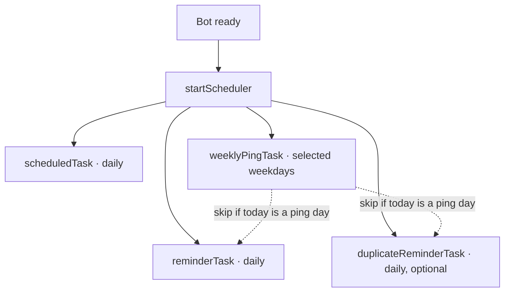

# Scheduler & Cron Jobs

The scheduler in `src/jobs/scheduler.ts` runs four independent cron jobs that drive the
bot's automated behaviour: the daily schedule post, two reminder DM sweeps, and the weekly
planning reminder.

## Overview



All jobs honour the bot timezone (`scheduling.timezone`, default `Europe/Berlin`). On
unrecognised timezones the scheduler falls back to the default and logs a warning.

## Configuration

| Setting | Description | Default |
| --- | --- | --- |
| `scheduling.dailyPostTime` | Time of day for the schedule post (HH:MM) | `18:00` |
| `scheduling.timezone` | IANA timezone for every cron expression | `Europe/Berlin` |
| `scheduling.reminderHoursBefore` | Hours before the post for the first reminder | `3` |
| `scheduling.duplicateReminderEnabled` | Enables the second reminder pass | `false` |
| `scheduling.duplicateReminderHoursBefore` | Hours before the post for the second reminder | `1` |
| `scheduling.weeklyPingEnabled` | Master toggle for the weekly planning DM | `true` |
| `scheduling.weeklyPingTime` | Time of day for the weekly planning DM (HH:MM) | `12:00` |
| `scheduling.weeklyPingDays` | Weekdays the planning DM runs on (`0=Sun..6=Sat`) | `[0, 1]` |

::: info Hot reload
Changing any of these settings via `POST /api/settings` triggers `reloadConfig()` and
`restartScheduler()` — there is no need to restart the bot process.
:::

## Jobs

### Daily schedule post

Posts the analysed schedule for today into the configured channel.

```
When:   scheduling.dailyPostTime          e.g. 18:00
Where:  discord.channelId

Flow:
  1. Load today's schedule from the database
  2. Apply absences and analyse status
     (FULL_ROSTER · WITH_SUBS · NOT_ENOUGH · OFF_DAY)
  3. Build the schedule embed and post it (with optional role ping)
  4. If enabled, create a training start poll
```

### Daily reminder (gaps DM)

Sends a warning-tone DM to every player who still has open days in the **current week**.

```
When:   dailyPostTime − reminderHoursBefore   e.g. 18:00 − 3h = 15:00
Skip:   today is in weeklyPingDays AND weeklyPingEnabled = true

Per player:
  - Skip coaches
  - Find missing days in Mon–Sun of the current week
  - Skip days where the user has an active absence
  - If any gap remains: DM with intro + up to 7 day-buttons
```

### Duplicate reminder (optional)

A second pass closer to the schedule post, intended as a last-chance nudge.

```
When:   dailyPostTime − duplicateReminderHoursBefore   e.g. 17:00
Skip:   today is in weeklyPingDays AND weeklyPingEnabled = true
Flow:   identical to the daily reminder
```

::: tip Day-of-month edge cases
Reminder times before midnight (e.g. post at 02:00 minus 3h) are scheduled at the
calculated hour on the **previous day** — the math wraps cleanly via cron.
:::

### Weekly planning reminder

A friendlier DM that targets the next or current week and replaces both reminder passes
on the days it runs.

```
When:    weeklyPingTime on the days listed in weeklyPingDays
Targets: Sunday → next week (Mon–Sun)
         any other day → current week

Per player:
  - Run addMissingDays() to seed schedule rows for the next 14 days
  - Refresh the pinned weekly overview message
  - DM each player who has open days for the target week,
    using the "Plan this/next week" copy
```

The bot guarantees players never get two DMs on the same day: when today is one of
`weeklyPingDays` the daily and duplicate reminders no-op (logged as
`"Daily reminder skipped · Today is a weekly planning day"`).

## Time math

Reminder times are computed relative to the schedule post:

```
Post:                   18:00
Reminder #1 (3h):       15:00
Reminder #2 (1h):       17:00
Weekly planning ping:   12:00 (independent — picks its own time)
```

## Control surface

```typescript
startScheduler();    // called on bot ready
stopScheduler();     // graceful shutdown
restartScheduler();  // settings change handler
```

`restartScheduler()` is called automatically after settings are saved or the config is
reloaded.

## Manual triggers

The same effects can be triggered on demand from the dashboard or chat.

**REST API**

```bash
POST /api/actions/schedule    # post today's schedule
POST /api/actions/remind      # send the gaps DM (ignores the date body field)
```

**Discord slash commands**

```text
/post-schedule    [date]      # admin
/remind                       # admin
```

::: warning Manual remind ignores the weekly-day skip
The admin-initiated `/remind` and dashboard "Send reminders" always run, even on a
weekly-ping day. This is intentional — manual actions reflect deliberate intent.
:::

## Example timeline (`dailyPostTime = 18:00`, Monday in `weeklyPingDays`)

```
12:00  ┤  weeklyPingTask
       │    → addMissingDays + refreshWeeklyOverview
       │    → DM "📆 Plan this week" to players with gaps
       │
15:00  ┤  reminderTask  · SKIPPED (today is a weekly ping day)
17:00  ┤  duplicateReminderTask · SKIPPED
       │
18:00  ┤  scheduledTask
       │    → schedule embed posted
       │    → training start poll created
       │
18:30  ┤  player updates availability
       │    → checkAndNotifyStatusChange()
       │    → status WITH_SUBS → FULL_ROSTER
       │    → updated embed posted
       │    → refreshWeeklyOverview() updates the pinned message
```
