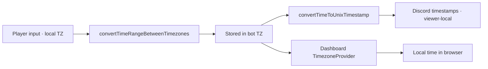

# Availability

Availability is the single most important data point in Synqed. Every player keeps
their own record per day; the bot derives all other state — daily status, training polls,
reminders — from those values.

## Per-day availability

Each `SchedulePlayer` row carries a free-form `availability` string:

| Value | Meaning | Display |
| --- | --- | --- |
| `""` (empty) | No response | ⚪ |
| `"x"` or `"X"` | Unavailable | ❌ |
| `"HH:MM-HH:MM"` | Single time window | ✅ + range |
| `"HH:MM-HH:MM, HH:MM-HH:MM"` | Multiple comma-separated windows | ✅ + ranges |

Times are stored in the **bot timezone** (`scheduling.timezone`). When a player has a
personal timezone, all inputs are converted on the way in and displayed in the local
timezone of the viewer using Discord timestamps.

## Setting availability

There are five entry points, all funneling into
`updatePlayerAvailability(date, userId, value)`:

| Entry point | What it does |
| --- | --- |
| `/set` slash command | Interactive date picker → modal or "Not Available" button |
| Pinned weekly overview | 7 day-buttons → time-input modal |
| Daily reminder DM | Up to 7 day-buttons → time-input modal |
| Weekly planning DM | Up to 7 day-buttons → time-input modal |
| Dashboard | User Portal → Schedule tab |

The time-input modal has three fields:

```
From:                 14:00
To:                   22:00
Additional windows:   17:00-20:00, 21:00-23:00   (optional)
```

All four producers route into the same `handleTimeModal` handler, so behaviour — timezone
conversion, change notifications, weekly-overview refresh — is identical regardless of
where the player triggered the modal.

::: tip Marking a day unavailable
The modal does not accept `x`. To mark a day as unavailable, use the **"❌ Not Available"**
button next to the time-input button in the daily schedule post, or use `/set` directly.
:::

## Recurring availability

Players can pin a weekly pattern. New schedule days inherit those values whenever a slot
is still empty.

### Data model

| Field | Type | Description |
| --- | --- | --- |
| `userId` | string | Discord ID |
| `dayOfWeek` | int (0–6) | 0 = Sunday … 6 = Saturday |
| `availability` | string | Time window or `"x"` |
| `active` | boolean | Toggle without deleting |

### Setting via Discord

```text
/set-recurring days:mon,wed,fri time:18:00-22:00
```

| Option | Description |
| --- | --- |
| `days` | Comma-separated weekdays (`mon, tue, wed, thu, fri, sat, sun`) |
| `time` | Time window `HH:MM-HH:MM` or `x` for unavailable |

### Viewing and clearing

```text
/my-recurring                   # tabular view of the current pattern
/clear-recurring                # remove every recurring entry
/clear-recurring day:monday     # remove a single weekday
```

### Apply logic

```
1. Identify empty SchedulePlayer slots in the next 14 days
2. Look up the user's recurring entry for that weekday
3. Apply only when the slot is still empty
4. Existing manual entries are never overwritten
5. Removing a recurring entry resets matching slots back to empty
```

Recurring patterns are applied at startup, after each weekly ping (`addMissingDays` +
`applyRecurringToEmptySchedules`), and any time the player edits their pattern.

## Absences

Players can mark longer absences (vacation, exam week, anything). Absences override
availability for the affected dates.

### Data model

| Field | Type | Description |
| --- | --- | --- |
| `userId` | string | Discord ID |
| `startDate` | string | First absent date (`DD.MM.YYYY`) |
| `endDate` | string | Last absent date (inclusive) |
| `reason` | string | Optional free text |

### Side effects

- The player is displayed as ✈️ in embeds and the dashboard
- The analyser treats them as unavailable
- Both daily and weekly reminder DMs skip them
- The pinned weekly overview shows ✈️ for the absent days

### Managing absences

**Dashboard (recommended)** — User Portal → Absences tab.

**API**

```bash
# create
POST /api/absences
{
  "startDate": "01.04.2026",
  "endDate":   "07.04.2026",
  "reason":    "Vacation"
}

# list
GET /api/absences

# delete
DELETE /api/absences/:id
```

## Timezone handling



1. Player enters times in their personal timezone (or the bot timezone if none is set)
2. The value is converted to the bot timezone before persistence
3. Discord embeds render times as `<t:TIMESTAMP:t>` so every viewer sees local time
4. The dashboard runs all conversion through `TimezoneProvider`

See [Timezones](/guide/timezones) for the full conversion pipeline.
