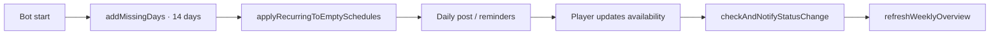
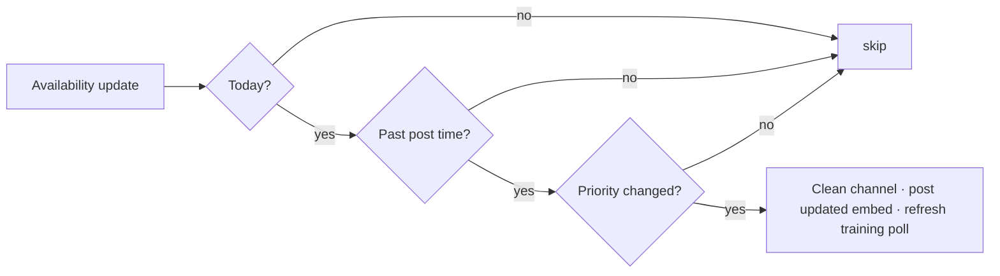

# Scheduling System

Scheduling is the heart of Schedule-Bot. It tracks one row per day, snapshots player
availability into that row, and surfaces the team's status across Discord and the
dashboard.

## Day records

Each day owns a single schedule entry:

| Field | Description |
| --- | --- |
| `date` | `DD.MM.YYYY` (stored as a unique TEXT column) |
| `reason` | Free text — e.g. `Training`, `Scrims`, `Premier`, `Off-Day`, `VOD-Review` |
| `focus` | Optional detail text (a topic, a map, a goal) |
| `players` | Snapshot of every registered player with their availability for the day |

::: tip Off-Day detection
Any `reason` containing `"off"` (case-insensitive) flips the analyser to `OFF_DAY` — no
roster math is performed and the daily post is short-circuited.
:::

## Status analyser

`analyzeSchedule()` in `src/shared/utils/analyzer.ts` derives a single status per day.

| Status | Trigger | Embed colour |
| --- | --- | --- |
| `OFF_DAY` | `reason` contains "off" | Purple |
| `FULL_ROSTER` | ≥ 5 MAIN players available | Green |
| `WITH_SUBS` | < 5 MAINs, but MAIN + SUB ≥ 5 | Orange |
| `NOT_ENOUGH` | Fewer than 5 players available total | Red |

Status priority for change notifications: `OFF_DAY` > `FULL_ROSTER` > `WITH_SUBS` >
`NOT_ENOUGH`.

## Availability values

The `availability` column on `SchedulePlayer` is a TEXT field with three shapes:

```
""                       — no response (⚪)
"x" or "X"               — unavailable (❌)
"HH:MM-HH:MM"            — single time window (✅)
"HH:MM-HH:MM,HH:MM-..."  — multiple comma-separated windows
```

Multi-window inputs come from the daily modal's "Additional windows" field. The analyser
unions overlapping windows when computing the common time range.

## Day-record lifecycle



- On bot start and at every weekly ping, `addMissingDays()` ensures the next 14 days have
  rows for every registered player.
- `applyRecurringToEmptySchedules()` fills empty slots from each player's weekly pattern
  (recurring availability).
- Manually set values are never overwritten by recurring patterns.

## The daily post

```
When:   scheduling.dailyPostTime
Where:  discord.channelId

  1. Load today's schedule
  2. Analyse status
  3. Build the embed and post it (with optional role ping)
  4. If training-start polls are enabled and training can proceed,
     create the poll
```

Details: [Scheduler & Cron Jobs](/bot/scheduler).

## Reminders

There are three distinct DM flows, all checking the **current week's gaps** (not just
today). Coaches and players with active absences are always skipped.

| Trigger | When | Tone |
| --- | --- | --- |
| `reminderTask` (daily) | `dailyPostTime − reminderHoursBefore` | Warning — "open days" |
| `duplicateReminderTask` (daily, optional) | `dailyPostTime − duplicateReminderHoursBefore` | Identical to above |
| `weeklyPingTask` | `weeklyPingTime` on selected weekdays | Friendly — "plan your week" |
| Dashboard "Send reminders" | manual click | Warning — "open days" |
| `/remind` admin slash command | manual call | Warning — "open days" |

::: tip Deduplication
On days listed in `weeklyPingDays`, both reminder cron jobs no-op. Players receive
exactly one DM that day — the friendlier `weeklyPingTask` one.
:::

## Change notifications

Every availability update funnels through `checkAndNotifyStatusChange()`. It only fires
**for today**, only **after the daily post time**, and only when the status priority
actually changes. Same-priority shuffles (e.g. one MAIN swapping with another) stay
silent.



If the new status allows training, a fresh training-start poll replaces any previous one.

## Roster synchronisation

`UserMapping` is the master roster; `SchedulePlayer` rows are per-day snapshots.

```
UserMappings (master)            SchedulePlayers (per day)
┌─────────────────────┐          ┌─────────────────────┐
│ Player A (MAIN)     │──sync──▶│ Player A (MAIN)     │
│ Player B (MAIN)     │──sync──▶│ Player B (MAIN)     │
│ Player C (SUB)      │──sync──▶│ Player C (SUB)      │
│ [new player]        │──add──▶ │ [new player]        │
└─────────────────────┘          └─────────────────────┘
```

Whenever the roster changes — register, unregister, role change —
`syncUserMappingsToSchedules()` rewrites all **future** snapshot rows so they reflect the
new roster.

## Setting availability

Players have three entry points; all of them feed into
`updatePlayerAvailability(date, userId, availability)` and trigger
`checkAndNotifyStatusChange()` + `refreshWeeklyOverview()`.

### Discord — `/set`

1. The bot shows a date select menu (next 14 days)
2. The player picks a date
3. They either submit a time window via modal or click "Not Available"
4. Times in the player's personal timezone are converted to the bot timezone
5. The DB is updated and a confirmation is sent ephemerally

### Discord — pinned weekly overview

The pinned message in `discord.channelId` carries seven date-buttons (Mon–Sun). Clicking
any opens the same modal as `/set`. The pinned message itself updates live.

### Discord — DM reminders

Daily and weekly DMs include up to seven day-buttons. They open the same modal.

### Dashboard

1. User Portal → Schedule tab
2. Pick a date and enter a window
3. `POST /api/schedule/update-availability` runs the same backend pipeline

See also: [Availability](/guide/availability), [Timezones](/guide/timezones).
